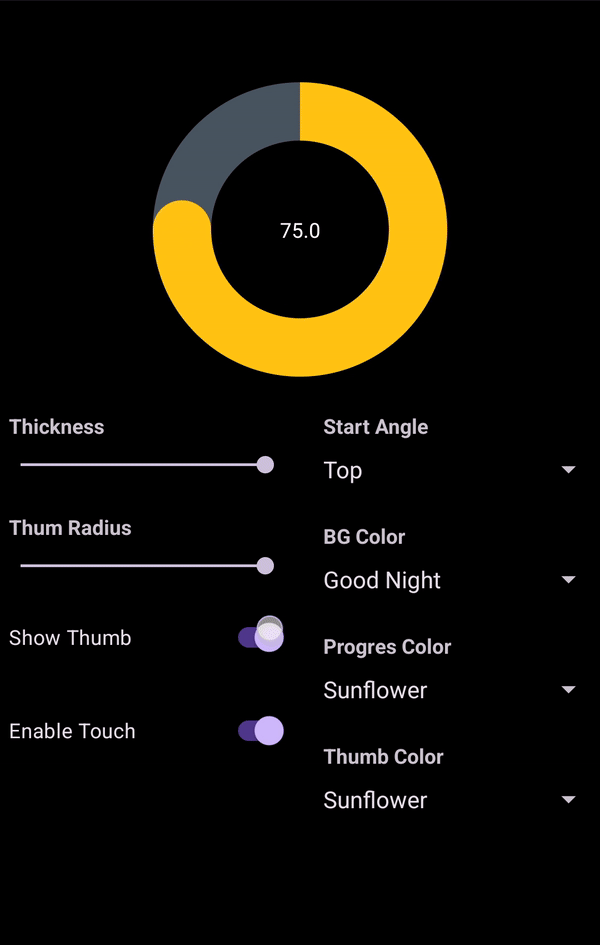

# circularseekbar

[](https://jitpack.io/#rajatsangrame/ImagesSubRedditViewer)



## Features

* Set progress with animation.
* Seek the progress by touch events.
* Modify the start angle of seekbar by 0, 90, 180 and 270 degrees.
* Option to change the color of seekbar elements
* Option to change the thickness of seekbar and thumb-radius.

Clone this repository play with the sample app to know more.

## Installation

```groovy
allprojects {
    repositories {
        jcenter()
        maven { url "https://jitpack.io" }
    }
}

dependencies {
    implementation 'com.github.rajatsangrame:circularseekbar:1.0.0'
}
```

## Usage

Define `CircularSeekbar` in your `activity_layout.xml`. You can define multiple
properties in xml declaration. Check the below example for the reference.

```xml

<com.rajatsangrame.circularseekbar.CircularSeekbar android:id="@+id/circularSeekbar"
    android:layout_width="250dp" android:layout_height="250dp" android:layout_marginTop="32dp"
    android:padding="24dp" app:backgroundColor="#9e9e9e" app:enableTouch="true"
    app:layout_constraintEnd_toEndOf="parent" app:layout_constraintStart_toStartOf="parent"
    app:layout_constraintTop_toTopOf="parent" app:progress="22" app:progressColor="#03a9f4"
    app:showThumb="true" app:startAngle="top" app:thickness="20dp" app:thumbColor="#ff5722"
    app:thumbPadding="4dp" app:thumbRadius="16dp" />
```

Defining the `CircularSeekbar` on runtime will work similar like any other views.
Check the below example for the reference.

```kotlin
    val circularSeekbar = CircularSeekbar(this)
circularSeekbar.setThickness(value)
circularSeekbar.setThumbRadius(value)
circularSeekbar.setStartAngle(StartAngle.TOP)
circularSeekbar.setBackgroundColor(Color.parseColor(color))
circularSeekbar.setProgressColor(Color.parseColor(color))
circularSeekbar.setThumbColor(Color.parseColor(color))
circularSeekbar.setEnableTouch(isChecked)
circularSeekbar.setShowThumb(isChecked)

circularSeekbar.setAnimatedProgress(progress = 75f, duration = 600L)

circularSeekbar.onProgressChanged { progress, _ ->
    findViewById<TextView>(R.id.tvprogress).text = "$progress"
}
```

We recommend to use equal padding for the `CircularSeekbar` else touch event might now work for now.

### License

```
   Copyright 2024 Rajat Sangrame

   Licensed under the Apache License, Version 2.0 (the "License");
   you may not use this file except in compliance with the License.
   You may obtain a copy of the License at

       http://www.apache.org/licenses/LICENSE-2.0

   Unless required by applicable law or agreed to in writing, software
   distributed under the License is distributed on an "AS IS" BASIS,
   WITHOUT WARRANTIES OR CONDITIONS OF ANY KIND, either express or implied.
   See the License for the specific language governing permissions and
   limitations under the License.
```


